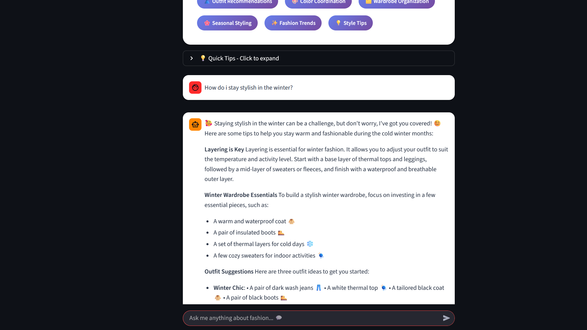

# 👔 AI Fashion Stylist

<div align="center">
A simple AI-powered fashion advisor chatbot built with Streamlit and Groq API. Get personalized fashion advice, outfit recommendations, and wardrobe organization tips.

**Your Personal AI-Powered Fashion Advisor**

[Features](#-features) • [Installation](#-installation) • [Usage](#-usage) • [Contributing](#-contributing)

</div>

---

## 📸 Screenshots

<div align="center">

### Main Chat Interface


*Beautiful gradient UI with real-time fashion advice*

### Example Conversation


*Get personalized outfit recommendations*

</div>

---

## ✨ Features

<table>
<tr>
<td width="50%">

### 🎨 Modern UI Design
- Beautiful gradient interface with purple theme
- Smooth animations and transitions
- Responsive design for all screen sizes

### 💬 Intelligent Fashion Advice
- Powered by Groq's Llama 3.3 70B model
- Context-aware conversations
- Personalized outfit recommendations

</td>
<td width="50%">

### 🗂️ Smart Organization
- Wardrobe organization tips
- Capsule wardrobe building
- Seasonal styling suggestions

### 🌈 Comprehensive Styling
- Color coordination advice
- Occasion-specific outfit ideas
- Budget-friendly fashion tips

</td>
</tr>
</table>

---

## 🚀 Installation

### Prerequisites

- Python 3.8 or higher
- Groq API key ([Get one free here](https://console.groq.com/keys))

### Setup Steps

```bash
# 1. Clone the repository
git clone https://github.com/wombus23/AI-Fashion-stylist.git
cd AI-Fashion-stylist

# 2. Create virtual environment
python -m venv venv

# 3. Activate virtual environment
# Mac/Linux:
source venv/bin/activate
# Windows:
venv\Scripts\activate

# 4. Install dependencies
pip install -r requirements.txt

# 5. Set up environment variables
cp .env.example .env
# Edit .env and add your Groq API key

# 6. Run the application
streamlit run app.py
```

🎉 Open your browser at `http://localhost:8501`

---

## 📁 Project Structure

```
ai-fashion-stylist/
│
├── 📄 app.py                   # Main entry point
├── 📄 requirements.txt         # Python dependencies
├── 📄 .env.example            # Environment variables template
├── 📄 README.md               # Documentation
│
├── 📁 backend/
│   └── ai_service.py          # Groq API integration
│
└── 📁 frontend/
    ├── styles.py              # Custom CSS styling
    ├── components.py          # Reusable UI components
    └── pages/
        └── chat.py            # Main chat interface
```

---

## 🎯 Usage

### Ask Fashion Questions

Simply type your question in the chat box:

```
💬 "What should I wear to a summer wedding?"
💬 "Help me organize my closet"
💬 "What colors go well with navy blue?"
```

### Quick Start Examples

Click any example question in the sidebar:

- 👔 What should I wear to a summer wedding?
- 🗂️ How do I build a capsule wardrobe?
- 🎨 What colors match with olive green?
- 📦 Help me organize my closet efficiently
- ✨ What's trending in fashion this season?
- 💼 Business casual outfit ideas?

---

## 🛠️ Configuration

### Change AI Model

Edit `backend/ai_service.py`:

```python
self.model = "llama-3.3-70b-versatile"
```

**Available Groq Models:**

| Model | Description |
|-------|-------------|
| `llama-3.3-70b-versatile` | Best balance (recommended) ⭐ |
| `llama-3.1-70b-versatile` | Good alternative |
| `mixtral-8x7b-32768` | Excellent for long context |
| `gemma2-9b-it` | Faster, lighter model |

### Customize Styling

Edit `frontend/styles.py` to change colors and theme:

```python
# Change gradient colors
background: linear-gradient(135deg, #667eea 0%, #764ba2 100%);
```

---

## 🤝 Contributing

Contributions are welcome! Follow these steps:

1. **Fork** the repository
2. **Create** a feature branch: `git checkout -b feature/amazing-feature`
3. **Commit** your changes: `git commit -m "feat: add amazing feature"`
4. **Push** to the branch: `git push origin feature/amazing-feature`
5. **Open** a Pull Request

### Commit Convention

We follow [Conventional Commits](https://www.conventionalcommits.org/):

| Prefix | Description |
|--------|-------------|
| `feat:` | New feature |
| `fix:` | Bug fix |
| `docs:` | Documentation changes |
| `style:` | Code style changes |
| `refactor:` | Code refactoring |

---

## 🐛 Troubleshooting

<details>
<summary><b>Command not found: streamlit</b></summary>

```bash
# Activate virtual environment
source venv/bin/activate  # Mac/Linux
venv\Scripts\activate      # Windows
```
</details>

<details>
<summary><b>No module named 'groq'</b></summary>

```bash
# Install dependencies
pip install -r requirements.txt
```
</details>

<details>
<summary><b>API Error 401</b></summary>

```bash
# Check your .env file
# Make sure GROQ_API_KEY is set correctly
```
</details>

<details>
<summary><b>Text not visible</b></summary>

```bash
# Clear browser cache and refresh
# Or restart the Streamlit app
```
</details>


## 📝 License

This project is licensed under the MIT License - see the [LICENSE](LICENSE) file for details.

---

## 🙏 Acknowledgments

- [Groq](https://groq.com/) for providing fast AI inference
- [Streamlit](https://streamlit.io/) for the amazing web framework
- [Llama 3.3](https://ai.meta.com/llama/) by Meta AI for the language model

---

<div align="center">

### 💬 Contact & Support

Have questions or suggestions?

[](https://github.com/wombus23/AI-Fashion-stylist/issues)
[](https://github.com/wombus23/AI-Fashion-stylist/pulls)

---

**Made with ❤️ and AI**

If you found this project helpful, please give it a ⭐!

[⬆ Back to Top](#-ai-fashion-stylist)

</div>
